<p align="center">
    <a href="https://monsieurbiz.com" target="_blank">
        
    </a>
    &nbsp;&nbsp;&nbsp;&nbsp;
    <a href="https://monsieurbiz.com/agence-web-experte-sylius" target="_blank">
        
    </a>
    <br/>
    
</p>

<h1 align="center">Rich Editor</h1>

[](https://github.com/monsieurbiz/SyliusRichEditorPlugin/blob/master/LICENSE.txt)
[](https://github.com/monsieurbiz/SyliusRichEditorPlugin/actions?query=workflow%3ATests)
[](https://scrutinizer-ci.com/g/monsieurbiz/SyliusRichEditorPlugin/?branch=master)


This plugin adds a rich editor on the fields you want. Now you can manage your content very easily!

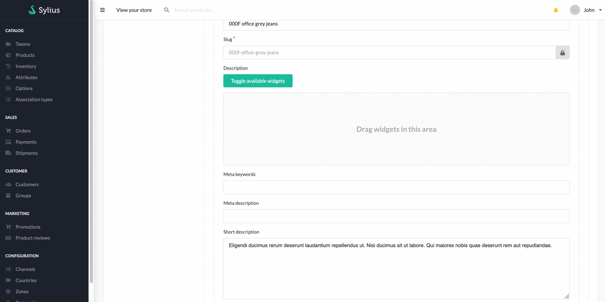

## Sylius Compatibility

| Sylius version | 1.8.x | 1.9.0 | 1.9.1 | 1.9.2 |
|----------------|:-----:|:-----:|:-----:|:-----:|
| Compatibility  | ✅    | ✅    | ❌    | ❌     |

## Installation

```bash
composer require monsieurbiz/sylius-rich-editor-plugin
```

Change your `config/bundles.php` file to add the line for the plugin : 

```php
<?php

return [
    //..
    MonsieurBiz\SyliusRichEditorPlugin\MonsieurBizSyliusRichEditorPlugin::class => ['all' => true],
];
```

Then create the config file in `config/packages/monsieurbiz_sylius_rich_editor.yaml` :

```yaml
imports:
    - { resource: "@MonsieurBizSyliusRichEditorPlugin/Resources/config/config.yaml" }
```

Finally import the routes in `config/routes/monsieurbiz_sylius_rich_editor.yaml` : 

```yaml
monsieurbiz_richeditor_admin:
    resource: "@MonsieurBizSyliusRichEditorPlugin/Resources/config/routing/admin.yaml"
    prefix: /%sylius_admin.path_name%
```

And install the assets
```yaml
bin/console asset:install
```

## Use the Rich Editor

### Update your form type

To make a field use the rich editor, you must use the `RichEditorType` type for it.  
We have an example of implementation in the [test application](/tests/Application/src/Form/Extension/ProductTypeExtension.php).

If your field has some data already, like some previous text before installing this plugin, 
then we will convert it for you as an HTML Element which contains… HTML.

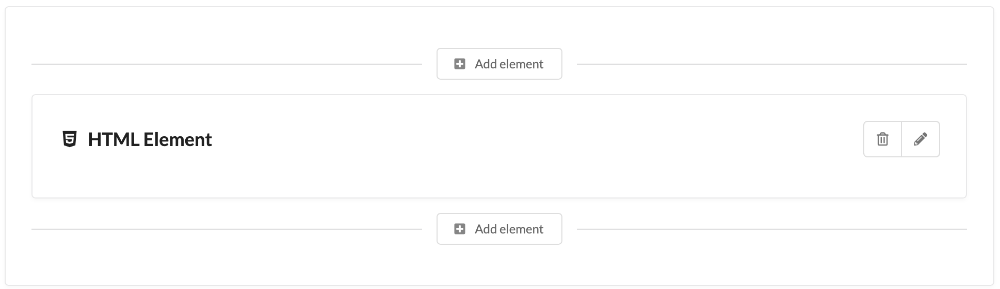

This way you will be able to use our plugin right away without risking any data lost!

### Call twig render

To display the content of the rich editor field you must call the twig filter:

```twig
{{ content | monsieurbiz_richeditor_render_field }}
```

You can see an example in the [test application](/tests/Application/templates/bundles/SyliusShopBundle/Product/Show/Tabs/Details/_description.html.twig)

### Custom rendering of elements

You can also render your elements with some custom DOM around that. To do so, you have access to a twig filter that 
gives you the elements list :

```twig

```

And then you can either render them all : 

```twig
{{ elements|monsieurbiz_richeditor_render_elements }}
```

Or one by one :
```twig

    {{ element|monsieurbiz_richeditor_render_element }}

```

### Filter the elements

If you want to filter the elements which are available for your field, you can use the `tags` option when you build your form.  
As example:

```php
$builder->add('description', RichEditorType::class, [
    'required' => false,
    'label' => 'sylius.form.product.description',
    'tags' => ['product'],
]);
```

In that example, only the Ui Elements with the tag `product` will be available.  
Don't worry, you can add this filter afterwards, we won't remove the already present Ui Elements of your field. But we
won't allow to add more if they don't have one of the allowed tags!

#### Example of setting tags to an Ui Element using yaml

```yaml
monsieurbiz_sylius_richeditor:
    ui_elements:
        app.my_element:
            # … 
            tags: ['product']
```

## Available elements

The plugin already contains some simple elements.

### HTML Element


### Text element


### Quote element

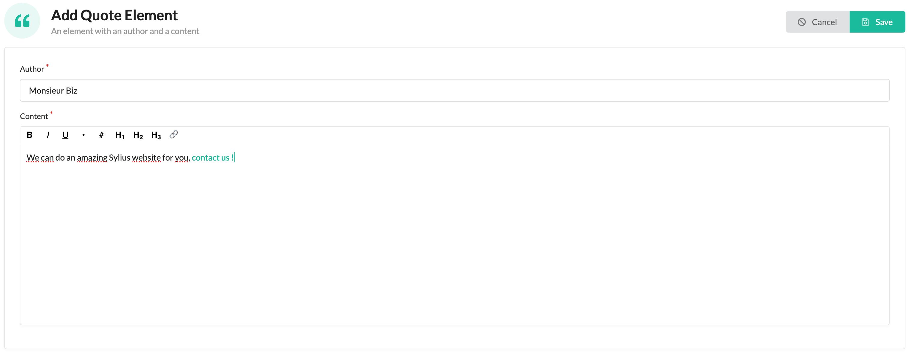

### Image element

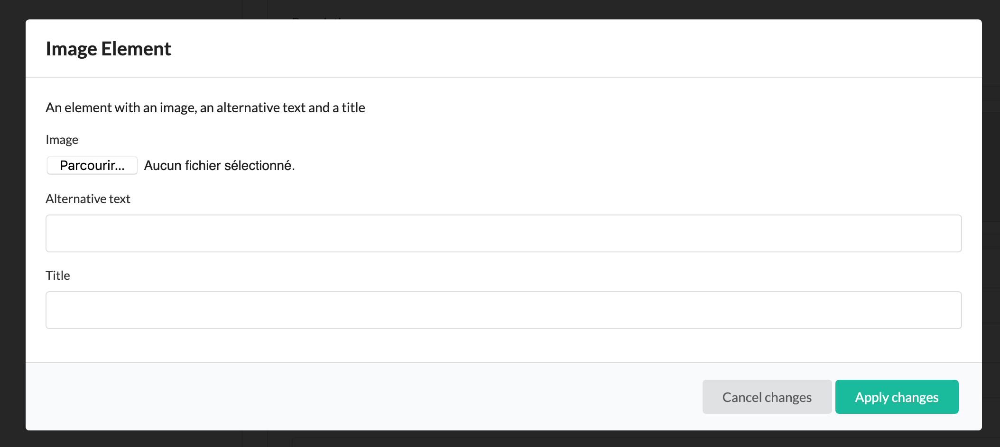

### Video element

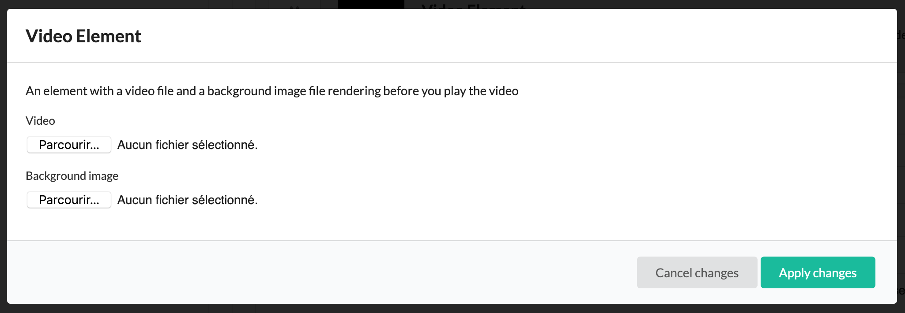

### Button element


### Title element

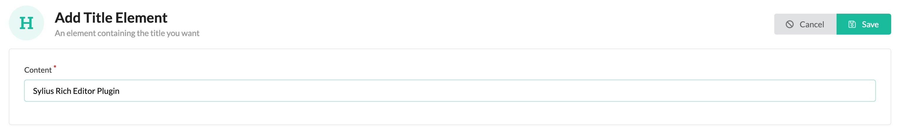

### Separator element


### Youtube element


### Image collection element

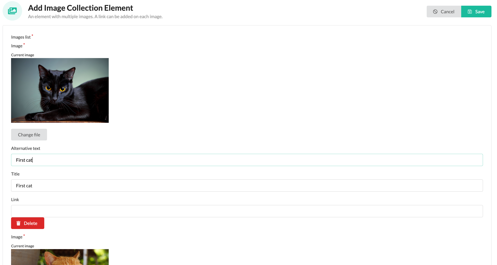

## Example of a rich product description

### Admin form with preview

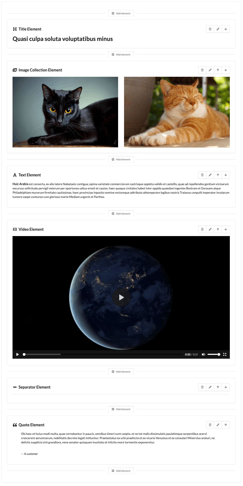

### Front display

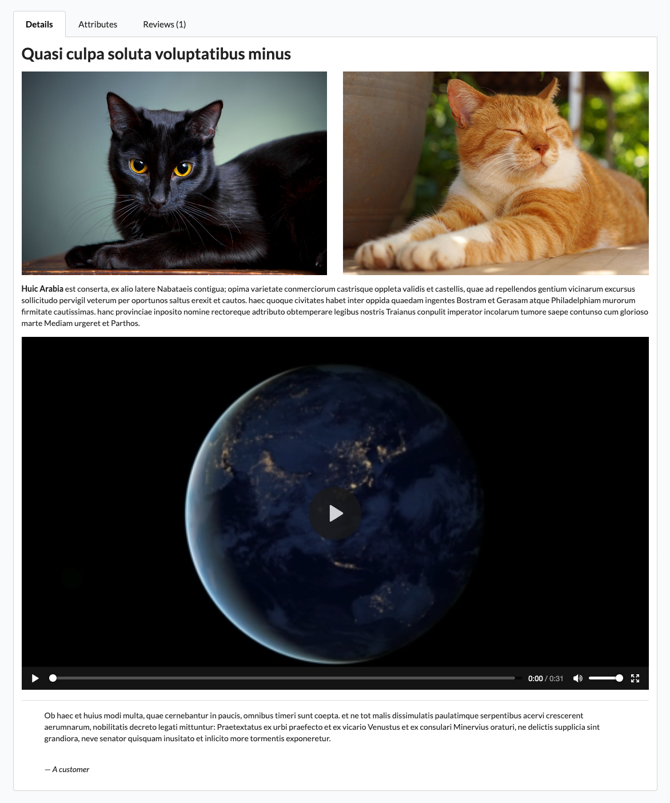

## Create your own elements

In this example, we will add a Google Maps element.

### Define your UiElement

Define your UiElement in your configuration folder, let's say in `config/packages/monsieurbiz_sylius_richeditor_plugin.yaml` as example.

```yaml
monsieurbiz_sylius_richeditor:
    ui_elements:
        app.google_maps:
            title: 'app.ui_element.google_maps.title'
            description: 'app.ui_element.google_maps.description'
            icon: map pin
            classes:
                form: App\Form\Type\UiElement\GoogleMapsType
                #ui_element: App\UiElement\MyUiElement
            templates:
                admin_render: '/Admin/UiElement/google_maps.html.twig'
                front_render: '/Shop/UiElement/google_maps.html.twig'
            tags: []
```

You can use your own Ui Element object if needed. Be sure to implement the
`\MonsieurBiz\SyliusRichEditorPlugin\UiElement\UiElementInterface` interface.  
A trait is there for you 🤗 as well. This is very useful when you need to do some custom work in your templates, it's like
having a helper around. The Ui Element is then available via the `ui_element` variable in your templates.

### Create the Form Type we use in admin to fill your UiElement

```php
<?php

declare(strict_types=1);

namespace App\Form\Type\UiElement;

use Symfony\Component\Form\AbstractType;
use Symfony\Component\Form\Extension\Core\Type\TextType;
use Symfony\Component\Form\FormBuilderInterface;
use Symfony\Component\Validator\Constraints as Assert;

class GoogleMapsType extends AbstractType
{
    public function buildForm(FormBuilderInterface $builder, array $options)
    {
        $builder
            ->add('link', TextType::class, [
                'label' => 'app.ui_element.google_maps.link',
                'required' => true,
                'constraints' => [
                    new Assert\NotBlank(),
                ],
            ])
        ;
    }
}
```

### Add your translations of course

Here is an example of possible translation for the GMap element : 

```yaml
app:
    ui_element:
        google_maps:
            title: 'Google Maps Element'
            short_description: 'Include a Google Maps'
            description: 'An element with a Google Maps link'
            link: 'Link'
```

### Create the templates to render it in front and in admin

You have to create a template for the front and also for the admin's preview.

Here is an example of a simple template for this our which can be used in front and admin:

```twig
<iframe id="gmap_canvas" src="{{ element.link }}" scrolling="no" marginheight="0" marginwidth="0" width="600" height="500" frameborder="0"></iframe>
```


### The result !

#### The element is in the UI Elements list

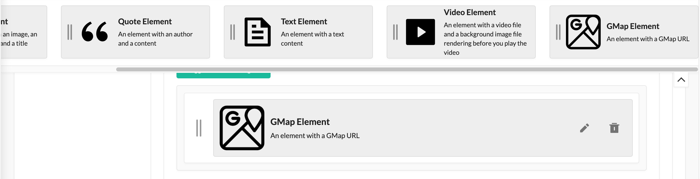

#### You now have a form to edit it (your form!)

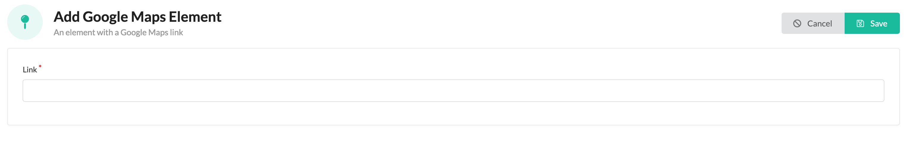

#### And we use your templates to render your UiElement

In admin : 

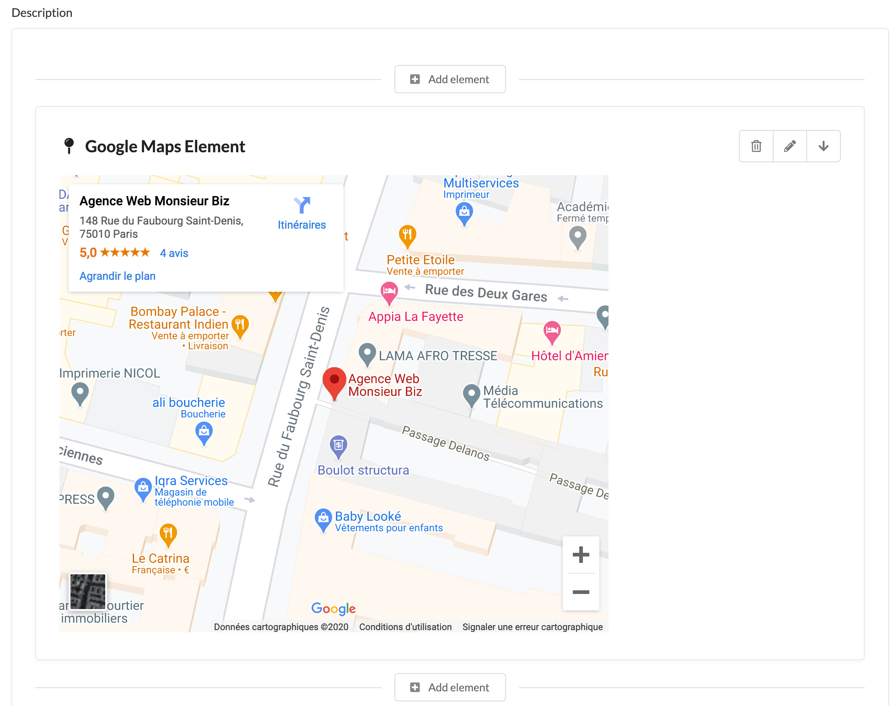

In front : 

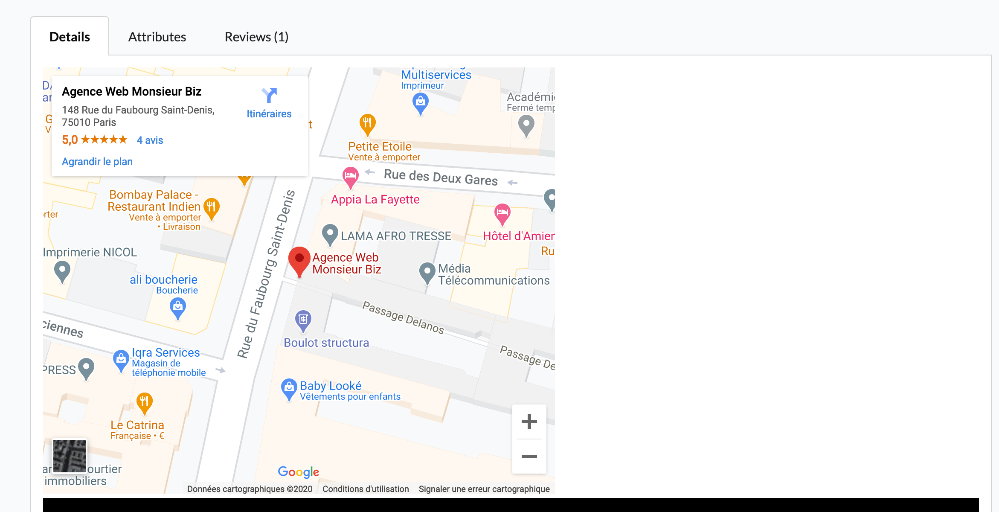

## Contributing

You can open an issue or a Pull Request if you want! 😘  
Thank you!
