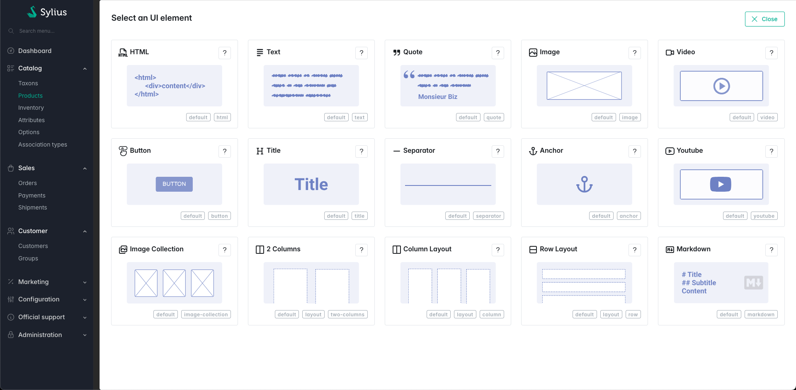
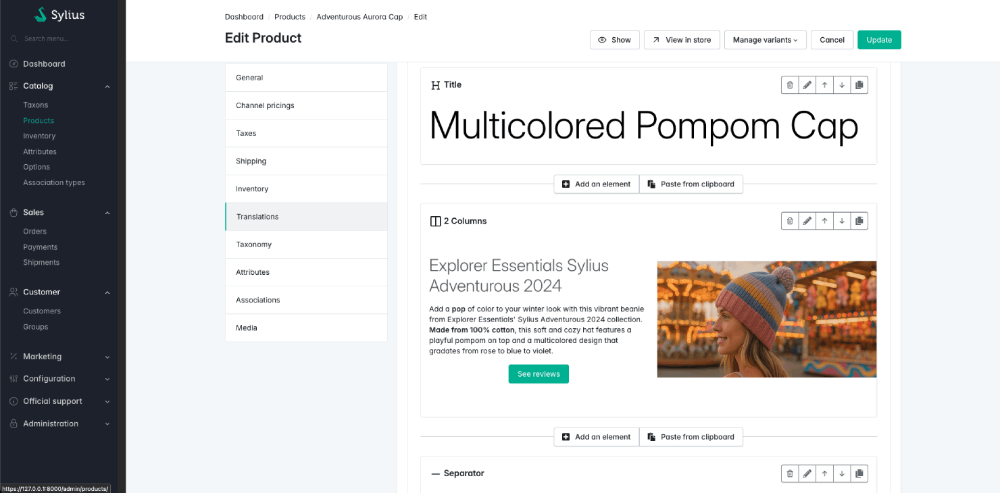
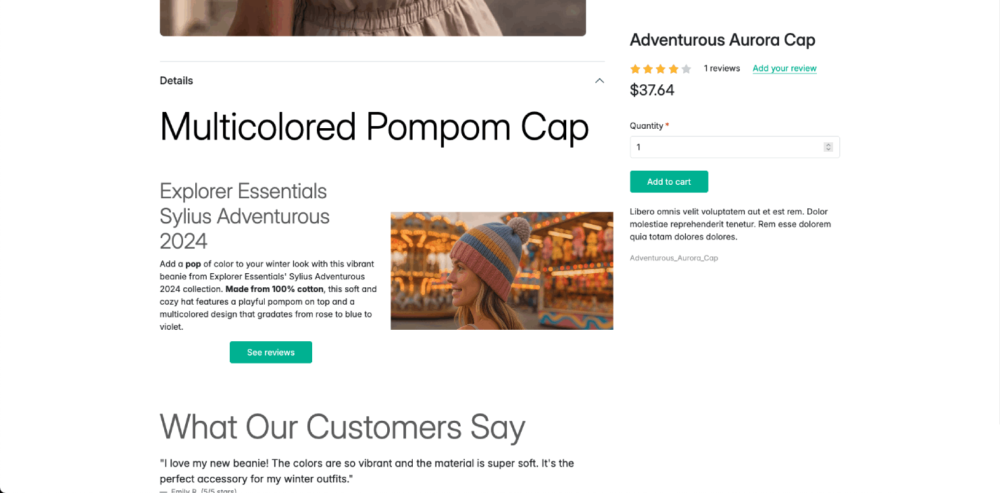

[](https://monsieurbiz.com/agence-web-experte-sylius)

<h1 align="center">Sylius Rich Editor</h1>

[](https://github.com/monsieurbiz/SyliusRichEditorPlugin/blob/master/LICENSE.txt)
[](https://github.com/monsieurbiz/SyliusRichEditorPlugin/actions?query=workflow%3ATests)
[](https://github.com/monsieurbiz/SyliusRichEditorPlugin/actions?query=workflow%3ASecurity)
[](https://github.com/monsieurbiz/SyliusRichEditorPlugin/actions?query=workflow%3ASecurity)

This plugin adds a rich editor on the fields you want. Now you can manage your content very easily!





## Compatibility

| Sylius Version | PHP Version     |
|----------------|-----------------|
| 2.0, 2.1       | 8.1 - 8.2       |

ℹ️ For Sylius 1.x, see our branch [branch 2.x] (https://github.com/monsieurbiz/SyliusRichEditorPlugin/tree/2.0) and all 2.x releases.

## Installation

### Require the plugin

If you want to use our recipes, you can configure your composer.json by running:

```bash
composer config --no-plugins --json extra.symfony.endpoint '["https://api.github.com/repos/monsieurbiz/symfony-recipes/contents/index.json?ref=flex/master","flex://defaults"]'
```

```bash
composer require monsieurbiz/sylius-rich-editor-plugin
```

<details>
<summary>For the installation without flex, follow these additional steps</summary>
<p>

Change your `config/bundles.php` file to add the line for the plugin : 

```php
<?php

return [
    //..
    Twig\Extra\TwigExtraBundle\TwigExtraBundle::class => ['all' => true],
    MonsieurBiz\SyliusRichEditorPlugin\MonsieurBizSyliusRichEditorPlugin::class => ['all' => true],
];
```

Then create the config file in `config/packages/monsieurbiz_sylius_rich_editor_plugin.yaml` :

```yaml
imports:
    - { resource: "@MonsieurBizSyliusRichEditorPlugin/Resources/config/config.yaml" }
```

Finally import the routes in `config/routes/monsieurbiz_sylius_rich_editor_plugin.yaml` : 

```yaml
monsieurbiz_richeditor_admin:
    resource: "@MonsieurBizSyliusRichEditorPlugin/Resources/config/routing/admin.yaml"
    prefix: /%sylius_admin.path_name%
```
</p>
</details>

### Correct `Twig\Extra\Intl\IntlExtension` and `Twig\Extra\String\StringExtension` conflict

If the recipe did not comment it, update the file `config/packages/twig.yaml` to comment or remove the `IntlExtension` and `StringExtension` declarations :

```yaml
# Twig\Extra\Intl\IntlExtension: ~
#Twig\Extra\String\StringExtension: ~
```

### Install the assets

If the `auto-script` is not in your `composer.json` project, you can install the assets with the following command:

```bash
bin/console asset:install
```

## Use it with the [Sylius Media Manager](https://github.com/monsieurbiz/SyliusMediaManagerPlugin/)

You don't need to do something, everything is compatible !

```
composer require monsieurbiz/sylius-media-manager-plugin="^2.0"
```

## Use the Rich Editor

### Update your form type

To make a field use the rich editor, you must use the `RichEditorType` type for it.  
We have an example of implementation in the [file for the test application](/test/src/Form/Extension/ProductTypeExtension.php).

If your field has some data already, like some previous text before installing this plugin, 
then we will convert it for you as an HTML Element which contains… HTML.

This way you will be able to use our plugin right away without risking any data lost!

⚠️ To have rich editor for original admin fields, like _Product description_, _Taxon desription_ etc. you have to update each form type by an extension as the example shows above.

### Call twig render

To display the content of the rich editor field you must call the twig filter:

```twig
{{ content | monsieurbiz_richeditor_render_field }}
```

You can see an example in the [file for the test application](/tests/TestApplication/templates/bundles/SyliusShopBundle/Product/Show/Tabs/Details/_description.html.twig)

### Custom rendering of elements

You can also render your elements with some custom DOM around that. To do so, you have access to a twig filter that 
gives you the elements list :

```twig

```

And then you can either render them all : 

```twig
{{ elements|monsieurbiz_richeditor_render_elements }}
```

Or one by one :
```twig

    {{ element|monsieurbiz_richeditor_render_element }}

```

### Filter the elements

If you want to filter the elements which are available for your field, you can use the `tags` option when you build your form.  
As example:

```php
$builder->add('description', RichEditorType::class, [
    'required' => false,
    'label' => 'sylius.form.product.description',
    'tags' => ['-default', 'product'],
]);
```

In that example, all Ui Elements with the tag `default` will be excluded, then the Ui Elements with the tag `product` will be included.  
Don't worry, you can add this filter afterwards, we won't remove the already present Ui Elements of your field. But we
won't allow to add more if they don't have one of the allowed tags!

#### Order matters

The order of the tags matters! The first tag will be less important then the second.  
As example, if you have 3 Ui Elements with the following tags:

- element1: tag1, tag2, tag3
- element2: tag1, tag2
- element3: tag2, tag3

And you set the tags of your field to `-tag1, tag2, -tag3`, then the only available Ui Element will be: `element2`.  
They all have the tag2 to include them, but the element1 and element3 have the tag3 which is excluding them after being both included.

#### Example of setting tags to an Ui Element using yaml

```yaml
monsieurbiz_sylius_richeditor:
    ui_elements:
        app.my_element:
            # … 
            tags: ['product']
```

### Deactivate an available element

Here is what really happens when deactivating an Ui Element:
- it's not displayed anymore in frontend
- it's still editable in backend for old contents but you can't add a new one
- if the element has an alias, the alias is treated the same way

Define the overload of a proposed UiElement in your configuration folder, let's say in `config/packages/monsieurbiz_sylius_richeditor_plugin.yaml` as example.

```yaml
monsieurbiz_sylius_richeditor:
    ui_elements:
        monsieurbiz.youtube:
            enabled: false
```

## Available elements

- Two columns element (Layout)
- Row Element (Layout)
- Column Element (Layout)
- HTML Element
- Markdown Element
- Text element
- Quote element
- Image element
- Video element
- Button element
- Title element
- Separator element
- Youtube element
- Image collection element
- Anchor element

## Create your own elements

In this example, we will add a Google Maps element.

With the Maker Bundle, you can create a new UiElement very easily: 

```bash
bin/console make:ui-element
```

Then you will have to answer some questions, or you can add arguments to the command to avoid the questions.

```bash
bin/console make:ui-element app.google_maps "map pin"
```

Just add the translations!

### Define your UiElement (for PHP < 8.1)

**Tips:** If you are using PHP 8.1 or newer, you can use the `#[AsUiElement]` attribute to define your UiElement. You can skip this step.

Define your UiElement in your configuration folder, let's say in `config/packages/monsieurbiz_sylius_richeditor_plugin.yaml` as example.

```yaml
monsieurbiz_sylius_richeditor:
    ui_elements:
        app.google_maps:
            title: 'app.ui_element.google_maps.title'
            description: 'app.ui_element.google_maps.description'
            icon: tabler:brand-google-maps
            classes:
                form: App\Form\Type\UiElement\GoogleMapsType
                #ui_element: App\UiElement\MyUiElement
            templates:
                admin_render: '/admin/ui_element/google_maps.html.twig'
                front_render: '/shop/ui_element/google_maps.html.twig'
            tags: []
```

You can use your own Ui Element object if needed. Be sure to implement the
`\MonsieurBiz\SyliusRichEditorPlugin\UiElement\UiElementInterface` interface.  
A trait is there for you 🤗 as well. This is very useful when you need to do some custom work in your templates, it's like
having a helper around. The Ui Element is then available via the `ui_element` variable in your templates.

### Create the Form Type we use in admin to fill your UiElement

```php
<?php

declare(strict_types=1);

namespace App\Form\Type\UiElement;

use Symfony\Component\Form\AbstractType;
use Symfony\Component\Form\Extension\Core\Type\TextType;
use Symfony\Component\Form\FormBuilderInterface;
use Symfony\Component\Validator\Constraints as Assert;

class GoogleMapsType extends AbstractType
{
    public function buildForm(FormBuilderInterface $builder, array $options)
    {
        $builder
            ->add('link', TextType::class, [
                'label' => 'app.ui_element.google_maps.link',
                'required' => true,
                'constraints' => [
                    new Assert\NotBlank(),
                ],
            ])
        ;
    }
}
```

For PHP 8.1 and newer, you can use the `#[AsUiElement]` attribute to define your UiElement. For example:

```php
<?php

// ...

use MonsieurBiz\SyliusRichEditorPlugin\Attribute\AsUiElement;

#[AsUiElement(
    code: 'app.google_maps',
    icon: 'tabler:brand-google-maps',
)]
class GoogleMapsType extends AbstractType
// ...
```

The title, description and templates values are generated automatically from the code. In this example :

- the title will be `app.ui_element.google_maps.title`,
- the description will be `app.ui_element.google_maps.description`,
- the admin template will be `/admin/ui_element/google_maps.html.twig`, 
- and the front template will be `/shop/ui_element/google_maps.html.twig`.

But you can override them if you want:

```php
#[AsUiElement(
    code: 'app.google_maps',
    title: 'my_cusom.title', // Use your own translation key or a string
    description: 'my_custom.description',
    icon: 'tabler:brand-google-maps',
    templates: new TemplatesUiElement(
        adminRender: 'admin/my_custom_path/google_maps.html.twig',
        frontRender: 'shop/my_custom_path/google_maps.html.twig',
    ),
    uiElement: GoogleMapsUiElement::class, // Use your own UiElement class
    tags: ['map'], // Add some tags to filter the UiElement
    wireframe: 'google_maps', // Add a wireframe to help the user to understand the UiElement, see below
)]
```

### Add your translations of course

Here is an example of possible translation for the GMap element : 

```yaml
app:
    ui_element:
        google_maps:
            title: 'Google Maps Element'
            short_description: 'Include a Google Maps'
            description: 'An element with a Google Maps link'
            link: 'Link'
```

### Create the templates to render it in front and in admin

You have to create a template for the front and also for the admin's preview.

Here is an example of a simple template for this our which can be used in front and admin:

```twig
<iframe id="gmap_canvas" src="{{ element.link }}" scrolling="no" marginheight="0" marginwidth="0" width="600" height="500" frameborder="0"></iframe>
```

## File in fixtures management

In some cases you will want to add UI elements to your content fixtures which are Rich Editor fields. If you need files in your UI elements, you can use a dedicated fixture. It is used as follows.   

```yaml
sylius_fixtures:
    suites:
        my_project:
            fixtures:
                my_files:
                    name: monsieurbiz_rich_editor_file
                    options:
                        files:
                            -   source_path: 'src/Resources/fixtures/bar1.png'
                                target_path: 'image/foo/bar1.png'
                            -   source_path: 'src/Resources/fixtures/file.pdf'
                                target_path: 'baz/file.pdf'
```

The example below will copy files to `public/media/image/foo/bar1.png` and `public/media/foo/file.pdf`.

Now you can use files in your content fixtures:

```yaml
description: |
    [{
        "code": "app.my_ui_element",
        "data": {
          "title": "My title",
          "image": "/media/image/foo/bar1.png",
          "file": "/media/baz/file.pdf"
        }
    }]
```

## Wireframes

You can add a wireframe to your UiElement. 
It will be displayed in the admin form to help the user to understand what the UiElement is about.
The file can be either:
* An SVG with a `.twig` extension. Example: `button.svg.twig`.
* A classic twig template. Example `button.html.twig`.
You can add the files in the folder : `templates/MonsieurBizSyliusRichEditorPlugin/wireframe/*.{svg/html}.twig`
In the YAML declaration of a UI Element, you can add the wireframe key with the name of the file without the extension.
```yaml
    monsieurbiz.title:
        alias: title
        title: 'monsieurbiz_richeditor_plugin.ui_element.monsieurbiz.title.title'
        description: 'monsieurbiz_richeditor_plugin.ui_element.monsieurbiz.title.description'
        icon: tabler:heading
        wireframe: title
        tags: [ default ]
        classes:
            form: MonsieurBiz\SyliusRichEditorPlugin\Form\Type\UiElement\TitleType
        templates:
            admin_render: '@MonsieurBizSyliusRichEditorPlugin/admin/ui_element/title.html.twig'
            front_render: '@MonsieurBizSyliusRichEditorPlugin/shop/ui_element/title.html.twig'
```

## Wysiwyg Type

The `WysiwygType` form type is a custom form type provided by the MonsieurBiz Sylius Rich Editor plugin. It extends the 
Symfony's `TextareaType` and provides a rich text editor interface in the admin form. It will work only in admin.

### Basic Usage

To use the `WysiwygType` in your form, you can add it to your form builder like this:

```php
$builder->add('content', WysiwygType::class, [
    'required' => false,
    'label' => 'app.form.content',
]);
```
### Options

The `WysiwygType` form type accepts several options:

- `editor_type`: The type of the editor. Default is `SunEditor::TYPE`. At this time, the only supported editor type is `SunEditor::TYPE`.
- `editor_height`: The height of the editor in pixels. Default is `300`.
- `editor_locale`: The locale of the editor. Default is the current admin locale or 'en' if it cannot be determined.
- `editor_toolbar_type`: The type of the toolbar. It can be one of the following: `EditorInterface::TOOLBAR_TYPE_MINIMAL`, `EditorInterface::TOOLBAR_TYPE_BASIC`, `EditorInterface::TOOLBAR_TYPE_FULL`, `EditorInterface::TOOLBAR_TYPE_CUSTOM`. Default is `EditorInterface::TOOLBAR_TYPE_BASIC`.
- `editor_toolbar_buttons`: An array of buttons to be displayed in the toolbar when `editor_toolbar_type` is `EditorInterface::TOOLBAR_TYPE_CUSTOM`. Default is `null`.
- `editor_custom_config`: An array of custom configuration options for the editor. Default is `null`.

Here is an example of how to use these options:

```php
$builder->add('content', WysiwygType::class, [
    'required' => false,
    'label' => 'app.form.content',
    'editor_height' => 500,
    'editor_locale' => 'fr',
    'editor_toolbar_type' => EditorInterface::TOOLBAR_TYPE_CUSTOM,
    'editor_toolbar_buttons' => [
        ['undo', 'redo'],
        ['bold', 'underline', 'italic', 'strike'],
        ['fontColor', 'hiliteColor'],
        ['removeFormat'],
        ['link'],
        ['showBlocks', 'codeView'],
    ],
    'editor_custom_config' => ['option1' => 'value1', 'option2' => 'value2'],
]);
```

In this example, we have set a custom editor type, increased the height of the editor, set the locale to French, chosen
a full toolbar, specified the buttons to be displayed in the toolbar, and provided some custom configuration options for 
the editor.

## Contributing

You can open an issue or a Pull Request if you want! 😘  
Thank you!
